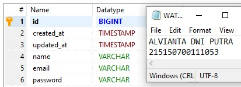
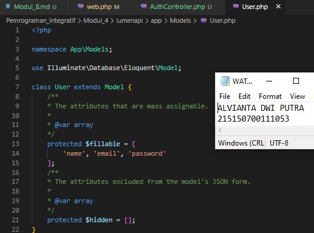
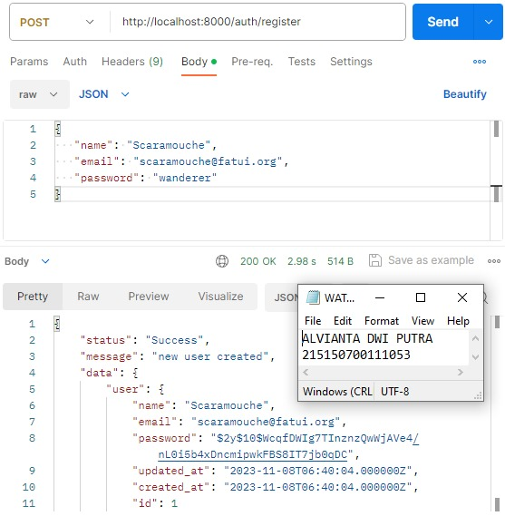
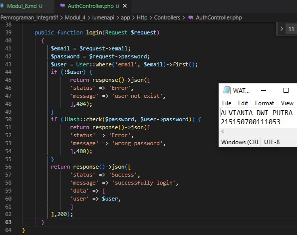
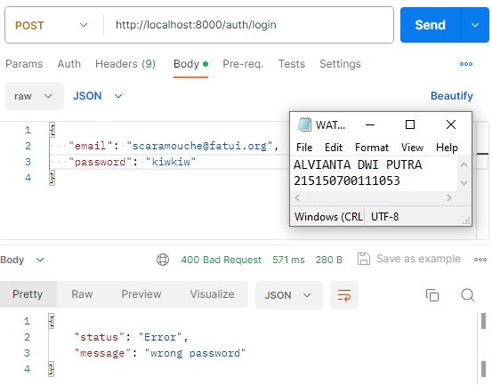
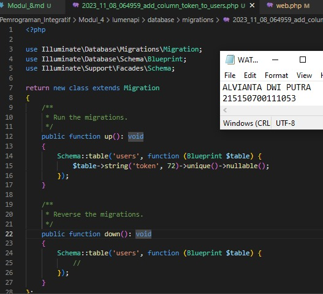
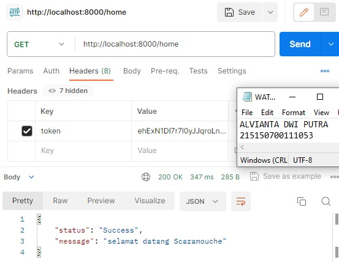
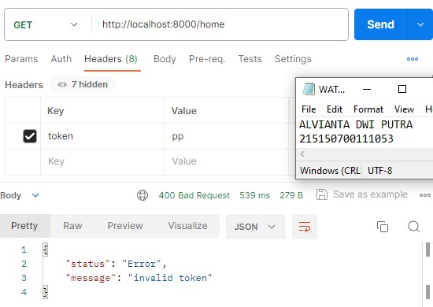
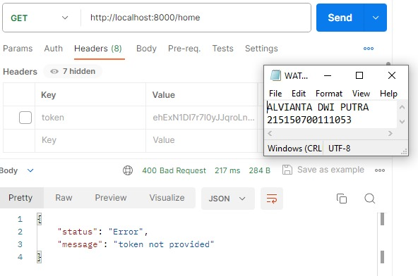

# Register Authentication dan Authorization

## Dasar teori

1. Authentication
   Authentication adalah proses untuk mengenali identitas dengan mekanisme pengasosiasian permintaan yang masuk dengan satu set kredensial pengidentifikasi. Kredensial yang diberikan akan dibandingkan dengan database informasi pengguna yang berwenang di dalam sistem operasi lokal atau server otentifikasi.
2. Token
   Token merupakan nilai yang digunakan untuk mendapatkan akses ke sumber daya yang dibatasi secara elektronik. Penggunaan token ditujukan pada web service yang tidak menyimpan state yang berkaitan dengan penggunaan aplikasi (stateless) seperti session.
3. Authorization
   Authorization merupakan proses pemberian hak istimewa yang dilakukan setelah proses authentication. Setelah pengguna diidentifikasi pada proses authentication, authorization akan memberikan hak istimewa dan tindakan yang diizinkan kepada pengguna yang ditentukan.

## Langkah Percobaan

> [!NOTE]
> menggunakan aplikasi lumenapi pada modul 4
> php -S localhost:8000 -t public

# Register

1. Pastikan terdapat tabel users yang dibuat menggunakan migration pada bab 3 Basic Routing dan Migration. Berikut informasi kolom yang harus ada
   `id`,`createdAt`, `updatedAt`, `name`, `email`, `password`
   <br>
   <br>
2. Pastikan terdapat model User.php yang digunakan pada bab 5 Model Controller dan Request-Response Handler. Berikut baris kode yang harus ada

   ```
   <?php
   namespace App\Models;
   use Illuminate\Database\Eloquent\Model;
   class User extends Model {
      /**
      * The attributes that are mass assignable.
      *
      * @var array
      */
      protected $fillable = [
         'name', 'email', 'password'
      ];
      /**
      * The attributes excluded from the model's JSON form.
      *
      * @var array
      */
      protected $hidden = [];
   }
   ```

   <br>
   <br>

3. Buatlah file AuthController.php dan isilah dengan baris kode berikut

   ```
   <?php

   namespace App\Http\Controllers;
   use App\Models\User;
   use Illuminate\Http\Request;
   use Illuminate\Support\Facades\Hash;

   class AuthController extends Controller
   {
      /**
      * Create a new controller instance.
      *
      * @return void
      */
      public function __construct()
      {
      //
      }
      public function register(Request $request)
      {
         $name = $request->name;
         $email = $request->email;
         $password = Hash::make($request->password);
         $user = User::create([
               'name' => $name,
               'email' => $email,
               'password' => $password
         ]);
         return response()->json([
               'status' => 'Success',
               'message' => 'new user created',
               'data' => [
                  'user' => $user,
               ]
         ],200);
      }
   }
   ```

   <br>
   <br>

4. Tambahkan baris berikut pada routes/web.php

   ```
   <?php
   ...
   $router->group(['prefix' => 'auth'], function () use ($router) {
   $router->post('/register', ['uses'=> 'AuthController@register']);
   });
   ```

   <br>
   <br>

5. Jalankan aplikasi pada endpoint /auth/register dengan body berikut
   {
   "name": "Scaramouche",
   "email": "scaramouche@fatui.org",
   "password": "wanderer"
   }
   <br>
   <br>

### Authentication

1. Buatlah fungsi login(Request $request) pada file AuthController.php

   ```
   public function login(Request $request)
      {
         $email = $request->email;
         $password = $request->password;
         $user = User::where('email', $email)->first();
         if (!$user) {
               return response()->json([
               'status' => 'Error',
               'message' => 'user not exist',
               ],404);
         }
         if (!Hash::check($password, $user->password)) {
               return response()->json([
               'status' => 'Error',
               'message' => 'wrong password',
               ],400);
         }
         return response()->json([
               'status' => 'Success',
               'message' => 'successfully login',
               'data' => [
               'user' => $user,
               ]
         ],200);
      }
   ```

   <br>
   <br>

2. Tambahkan baris berikut pada routes/web.php

   ```
   <?php
   ...
   $router->group(['prefix' => 'auth'], function () use ($router) {
      $router->post('/register', ['uses'=> 'AuthController@register']);
      $router->post('/login', ['uses'=> 'AuthController@login']); // route login
   });
   ```

   <br>
   <br>

3. Jalankan aplikasi pada endpoint /auth/login dengan body berikut

   ```
   {
      "email": "scaramouche@fatui.org",
      "password": "wanderer"
   }
   ```

   <br>
   <br>

   > [!NOTE]
   > coba lakukan dengan menyalahkan email atau password

   <br>
   <br>

### Token

1. Jalankan perintah berikut untuk membuat migrasi baru
   `php artisan make:migration add_column_token_to_users`
   <br>
   <br>
2. Tambahkan baris berikut pada migration yang baru terbuat

   ```
   <?php

   use Illuminate\Database\Migrations\Migration;
   use Illuminate\Database\Schema\Blueprint;
   use Illuminate\Support\Facades\Schema;

   return new class extends Migration
   {
      /**
      * Run the migrations.
      */
      public function up(): void
      {
         Schema::table('users', function (Blueprint $table) {
               $table->string('token', 72)->unique()->nullable();
         });
      }

      /**
      * Reverse the migrations.
      */
      public function down(): void
      {
         Schema::table('users', function (Blueprint $table) {
               //
         });
      }
   };

   ```

   <br>
   <br>

3. Tambahkan atribut token di $fillable pada User.php

   ```
   <?php

   namespace App\Models;

   use Illuminate\Database\Eloquent\Model;

   class User extends Model {
      /**
      * The attributes that are mass assignable.
      *
      * @var array
      */
      protected $fillable = [
         'name', 'email', 'password', 'token'
      ];
      /**
      * The attributes excluded from the model's JSON form.
      *
      * @var array
      */
      protected $hidden = [];
   }

   ```

   <br>
   <br>

4. Tambahkan baris berikut pada file AuthController.php

   ```
   use Illuminate\Support\Str;
   ...
   public function login(Request $request)
      {
         $email = $request->email;
         $password = $request->password;
         $user = User::where('email', $email)->first();
         if (!$user) {
               return response()->json([
               'status' => 'Error',
               'message' => 'user not exist',
               ],404);
         }
         if (!Hash::check($password, $user->password)) {
               return response()->json([
               'status' => 'Error',
               'message' => 'wrong password',
               ],400);
         }
         $user->token = Str::random(36); //
         $user->save(); //
         return response()->json([
               'status' => 'Success',
               'message' => 'successfully login',
               'data' => [
                  'user' => $user,
               ]
         ],200);
      }
   ```

   <br>
   <br> 5. Jalankan perintah di bawah untuk menjalankan migrasi terbaru
   `php artisan migrate`
   <br>
   <br> 6. Jalankan aplikasi pada endpoint /auth/login dengan body berikut. Salinlah token yang didapat ke notepad

   ```
      {
         "email": "scaramouche@fatui.org",
         "password": "wanderer"
      }

   ```

   <br>
   <br>

### Authorization

1. Buatlah file Authorization.php pada folder App/Http/Middleware dan isilah dengan baris berikut

   ```
   <?php

   namespace App\Http\Middleware;
   use App\Models\User;
   use Closure;

   class Authorization
   {
      /**
      * Handle an incoming request.
      *
      * @param \Illuminate\Http\Request $request
      * @param \Closure $next
      * @return mixed
      */
      public function handle($request, Closure $next)
      {
         $token = $request->header('token') ?? $request->query('token');
         if (!$token) {
               return response()->json([
               'status' => 'Error',
               'message' => 'token not provided',
               ],400);
         }
         $user = User::where('token', $token)->first();
         if (!$user) {
               return response()->json([
               'status' => 'Error',
               'message' => 'invalid token',
               ],400);
         }
         $request->user = $user;
         return $next($request);
      }
   }
   ```

   <br>
   <br>

2. Tambahkan middleware yang baru dibuat pada bootstrap/app.php.

   ```
   /*
   |--------------------------------------------------------------------------
   | Register Middleware
   |--------------------------------------------------------------------------
   |
   | Next, we will register the middleware with the application. These can
   | be global middleware that run before and after each request into a
   | route or middleware that'll be assigned to some specific routes.
   |
   */
   // $app->middleware([
   // App\Http\Middleware\ExampleMiddleware::class
   // ]);
   $app->routeMiddleware([
      'auth' => App\Http\Middleware\Authorization::class, //
   ]);
   ```

   <br>

3. Buatlah fungsi home() pada HomeController.php

   ```
   public function home(Request $request)
      {
         $user = $request->user;
         return response()->json([
               'status' => 'Success',
               'message' => 'selamat datang ' . $user->name,
      ],200);
      }
   ```

<br>

4. Tambahkan baris berikut pada routes/web.php

   ```
   <?php
   $router->get('/', ['uses' => 'HomeController@index']);
   $router->get('/hello', ['uses' => 'HomeController@hello']);
   $router->get('/home', ['middleware' => 'auth','uses' => 'HomeController@home']); //
   ...
   ```

   <br>
   <br> 5. Jalankan aplikasi pada endpoint /home dengan melampirkan nilai token (pada header) yang
   didapat setelah login pada header
   <br>
   <br>Dengan token yang tidak sesuai
   <br>
   <br>Tanpa token
   <br>
